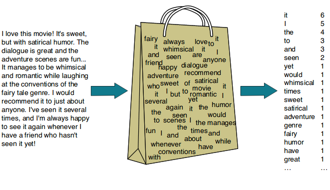

# LSA: Text Classification

*Linear Algebra (ECE) | Spring 2023 | Dr. Sarafraz | University of Tehran*

*A Project Designed by: [Erfan Asgari](https://github.com/erfanasgari21), [Fardin Abbasi](https://github.com/fardinabbasi)*

This project applies Latent Semantic Analysis (LSA) to classify news articles into five categories based on their semantic content. It involves constructing a Bag of Words and applying Truncated SVD to generate word embeddings that capture latent semantics. Students will then analyze the resulting latent space and use similarity metrics to group documents by topic.

## Introduction to NLP

Latent Semantic Indexing (LSI) is a scientific approach used in **Natural Language Processing (NLP)** that helps machines understand human language and even reproduce it. NLP can be divided into two main branches:  
1. Natural Language Understanding (NLU)
2. Natural Language Generation (NLG)

> [!TIP]
Markov Chains can also be used for text generation, where the sequence of words is determined based on the probability of word pair occurrences. For more information, check out [this blog ](https://bespoyasov.me/blog/text-generation-with-markov-chains/) on text generation with Markov Chains.

In this project, we will focus on the application of LSI in **semantic extraction** from text.

## Bag of Words

Machines face significant challenges in understanding words because they do not inherently grasp the meanings or relationships between them as humans do. Unlike humans, who associate words with concepts and contexts, machines treat words as isolated symbols. However, machines are adept at working with numbers. To bridge this gap, we transform words into numerical representations, known as **embedding vectors**. By converting words into vectors, we can encode semantic similarities and relationships in a format that machines can process, enabling them to perform tasks like text classification or understanding with greater accuracy.

_photo from [NLP: Bag of words](https://ogre51.medium.com/nlp-explain-bag-of-words-3b9fc4f211e8) by Rahul S_

One basic approach to creating such embeddings is the **Bag of Words (BoW)** model. In this method, we create a matrix $$ B = [f_{i,j}] $$, where $$ f_{i,j} $$ represents the frequency of word _j_ in document _i_. This matrix captures how often each word appears in each document, without considering the order of the words. While simple, BoW is a powerful way to transform textual data into a format that machines can work with, laying the foundation for more complex analyses, such as document classification or similarity comparison.

## Latent Semantic Analysis

Latent Semantic Indexing (LSI) is an algorithm designed to uncover hidden relationships between words in a text by representing them in a lower-dimensional space. By using techniques like Singular Value Decomposition (SVD), LSI transforms textual data into numerical vectors, known as **word embeddings**, which capture the underlying semantic structures within the data. 

These embeddings help to represent words and documents in a continuous vector space, where similar words are positioned closer together based on their usage across documents. This approach is widely used in information retrieval and search engine optimization, enabling machines to understand the semantic similarity between different terms and documents more effectively.

In this method, we apply Truncated SVD to decompose the Bag of Words (BoW) matrix into three matrices, revealing underlying "concepts" that were not explicitly present in the original data:

## Theoretical Questions

1. Explain the use of **Term Frequency (TF)** and **Inverse Document Frequency (IDF)** in text. Why can these values be misleading if studied independently?

2. Describe one of the methods used to determine the threshold for reducing the rank in **Truncated SVD**. What is the "elbow point"?

3. How do we calculate **reconstruction error** in Truncated SVD?

4. Provide the mathematical relationships for **Cosine Similarity** and **Euclidean Distance**, and explain how they are used to compare the similarity between vectors. Explain the meaning of the range and boundaries of these metrics.

5. Why is **standardization** necessary before applying SVD to the documents-words matrix? Discuss its importance.

6. Discuss the performance and application of **Randomized SVD** for large matrices. Include pseudocode for this algorithm.

## Implementation Questions

A **dataset** of 2,225 short English news articles on various topics is provided for analysis using LSI.  
The data can be downloaded from [here](https://www.kaggle.com/datasets/tanishqdublish/text-classification-documentation) in `csv` format which contains the articles along with their topic labels.

7. Preprocess the text by removing punctuation and lowercase all letters.

8. Perform word frequency analysis to identify the 30 most frequent words across all documents. Are these words useful in understanding the topic of documents?

9. Generate a **Word Cloud** to visualize these frequently occurring words.

10. Construct a **Bag of Words (BoW)** matrix and count the occurrence of each word in every document. Create this matrix based on the words in `words.csv`.

    Let $B = [f_{i,j}]$ where $f_{i,j}$ is the frequency of word _j_ in document _i_.

> [!NOTE]
> Separate the first 2000 rows of data from the remaining rows. Set aside the remaining 225 rows as **test data** and do not use them until the last question. Apply the tasks requested in the upcoming questions only to the first 2000 rows.

11. Standardize the BoW matrix and perform **SVD** on the resulting matrix.

    Report the dimensions of the resulting matrices.

12. By plotting the necessary graphs, suggest an appropriate threshold for truncating the singular values for rank reduction. Based on this, perform Truncated SVD by truncating the existing matrices and report the reconstruction error.

13. Implement the **Randomized SVD** function. This function takes a matrix and the rank of the target space as inputs and, based on the pseudocode you provided, decomposes the input matrix and returns the singular value matrix, as well as the left and right singular vectors.

14. Run the Randomized SVD function with the rank corresponding to the proposed threshold on the Bag of Words matrix, and compare its reconstruction error with that of Truncated SVD. If our dataset included the entire collection of texts available on the internet, which decomposition method would you recommend?

15. For each of the components resulting from **Truncated SVD**, find and display the 5 words with the highest magnitude in that direction. Based on the words obtained, try to guess the hidden meaning that some of the components might represent.

16. Use the **Cosine Similarity** and **Euclidean Distance** metrics to evaluate the similarity of the following word pairs in the latent space, and provide your interpretation of the results:
    - (mobile, technology)
    - (director, film)
    - (win, won)
    - (play, game)
    - (play, law)
    - (government, music)

> [!TIP]
Explore [ this insightful website](https://projector.tensorflow.org/) on visualizing high-dimensional data from **Word2Vec**, an advanced word embedding technique that captures semantic relationships between words using more sophisticated methods.

17. Since now there is also a vector in the latent space for each document, representing the combination of concepts in the document, calculate the **Cosine Similarity** between the document whose number matches the last 3 digits of your student ID and each of the given words. Display the results in a wide bar chart. Also, display the frequency of each of these words in the document below the chart, and compare the two charts.

18. If we want to search for the word "technology" in a text database, how could the use of the latent space help identify a relevant document that doesn't contain the word "technology" but includes words like "mobile" and "digital"? What advantage does searching in the latent space have over searching in the Bag of Words space in terms of computational cost?

19. The second column of the dataset provided shows the topic labels of the texts, which are coded from 0 to 4 as follows:

    0. Politics
    1. Sport
    2. Technology
    3. Entertainment
    4. Business

For the texts belonging to each category, calculate the average latent space vector and display them on a **heatmap**. Propose a method to label and classify texts using the latent space representation.

> [!WARNING]
 The proposed method should take into account the fact that we do not explicitly know the meaning of each component in the latent space, and while you tried to intuit some of them in question 15, this is not scalable in real-world applications.

20. Implement your proposed labeling method and evaluate its accuracy on the test data. Also, calculate the classification accuracy for each of the different categories separately.

$$
Accuracy=\frac{Correct \ Predictions}{Total \ Predictions}
$$

