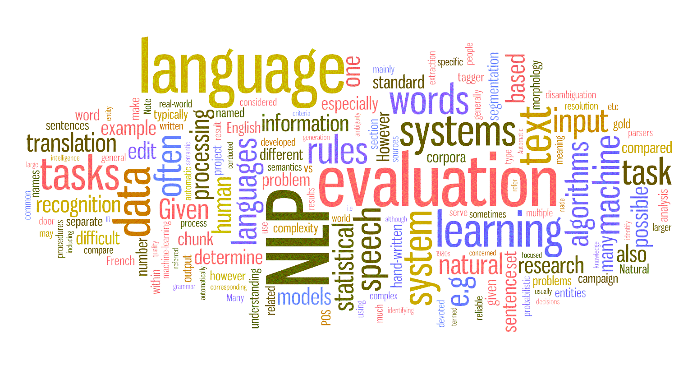

# LSA: Text Classification

*Linear Algebra (ECE) | Spring 2023 | Dr. Sarafraz | University of Tehran*

*A Project Designed by: [Erfan Asgari](https://github.com/erfanasgari21), [Fardin Abbasi](https://github.com/fardinabbasi)*

This project applies Latent Semantic Indexing (LSI) to classify news articles into five categories based on their semantic content. The process involves text preprocessing steps, constructing a Bag of Words, applying Truncated Singular Value Decomposition (TruncatedSVD) to reduce the dimensionality of the term-document matrix and capture the most relevant semantic features. Students will then analyze and compare documents using similarity metrics such as Cosine Similarity and Euclidean Distance to group articles by topic.

#### Objectives
- To preprocess textual data using techniques like Bag of Words and understand TF-IDF for term weighting.
- To implement Truncated Singular Value Decomposition (SVD) for dimensionality reduction in text data.
- To explore the effects of standardization on the term-document matrix for improved classification performance.
- To classify articles based on semantic relationships using similarity metrics like Cosine Similarity and Euclidean Distance.
- To gain hands-on experience with text classification and word embeddings in Natural Language Processing (NLP).

#### Links
- [Project Description (En)](Description-En.md)
- [Original Description (Fa)](Description-Fa.pdf)
- [Implementation Code (ipynb)](Code.ipynb)

