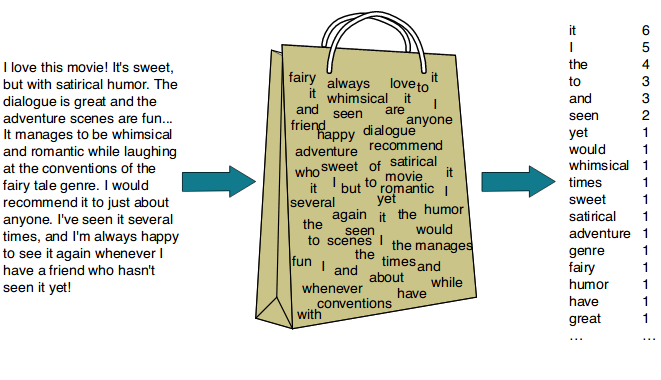
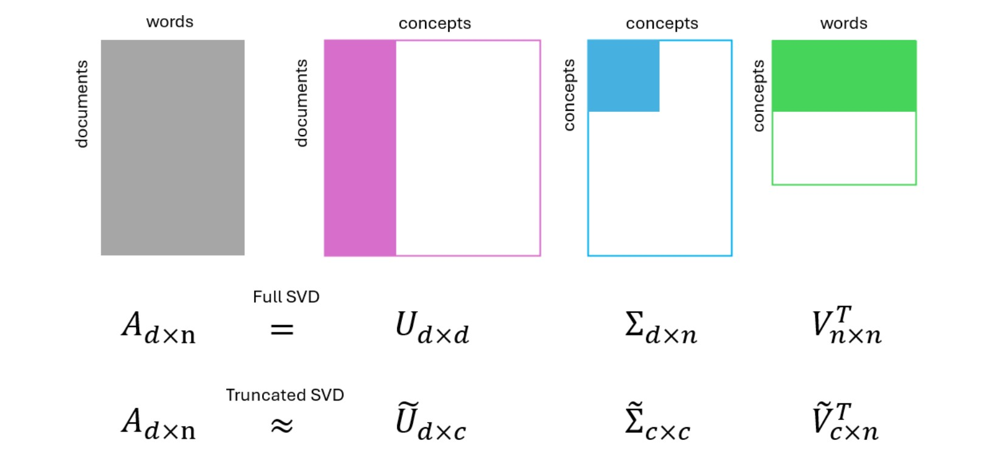
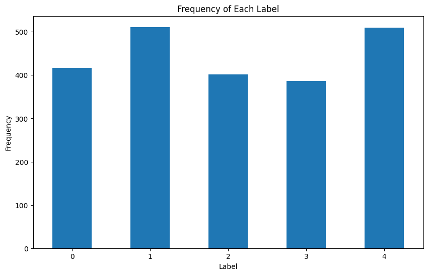
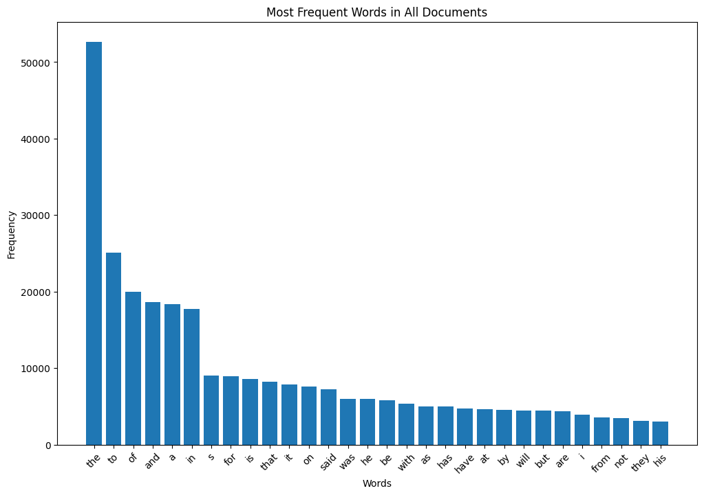
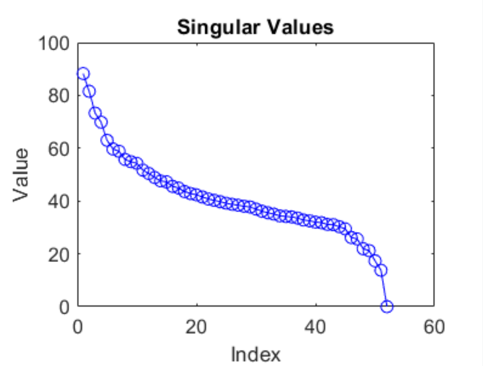
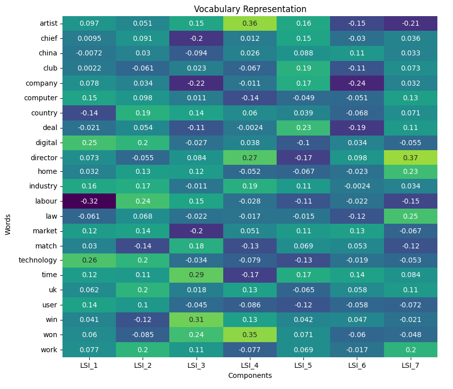
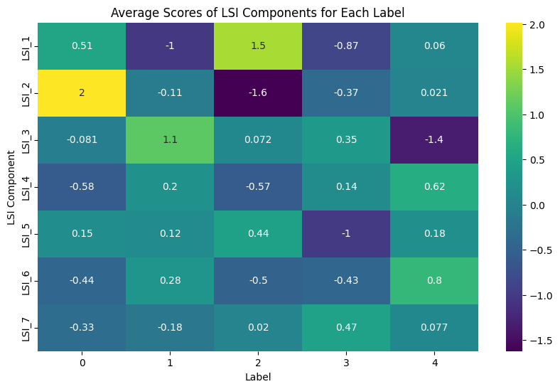
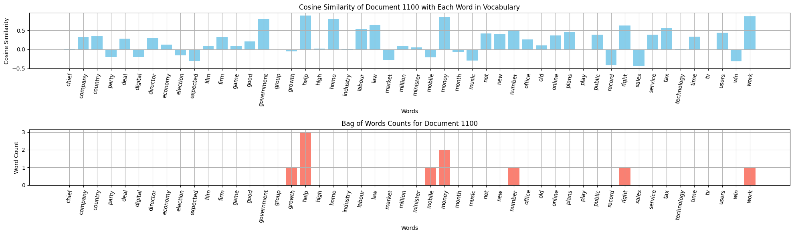

# LSA: Text Classification

*Linear Algebra (ECE) | Spring 2023 | Dr. Sarafraz | University of Tehran*

*A Project Designed by: [Erfan Asgari](https://github.com/erfanasgari21), [Fardin Abbasi](https://github.com/fardinabbasi)*


This project applies Latent Semantic Indexing (LSI) to classify news articles into five categories based on their semantic content. The process involves text preprocessing steps, constructing a Bag of Words, applying Truncated Singular Value Decomposition (TruncatedSVD) to reduce the dimensionality of the term-document matrix and capture the most relevant semantic features. Students will then analyze and compare documents using similarity metrics such as Cosine Similarity and Euclidean Distance to group articles by topic.

#### Objectives
- To preprocess textual data using techniques like Bag of Words and understand TF-IDF for term weighting.
- To implement Truncated Singular Value Decomposition (SVD) for dimensionality reduction in text data.
- To explore the effects of standardization on the term-document matrix for improved classification performance.
- To classify articles based on semantic relationships using similarity metrics like Cosine Similarity and Euclidean Distance.
- To gain hands-on experience with text classification and word embeddings in Natural Language Processing (NLP).

#### Links
- [Project Description (En)](Description-En.md)
- [Original Description (Fa)](Description-Fa.pdf)
- [Implementation Code (ipynb)](Code.ipynb)


## Introduction to NLP

Latent Semantic Indexing (LSI) is a scientific approach used in **Natural Language Processing (NLP)** that helps machines understand human language and even reproduce it. NLP can be divided into two main branches:  
1. Natural Language Understanding (NLU)
2. Natural Language Generation (NLG)

> [!TIP]
Markov Chains can also be used for text generation, where the sequence of words is determined based on the probability of word pair occurrences. For more information, check out [this blog ](https://bespoyasov.me/blog/text-generation-with-markov-chains/) on text generation with Markov Chains.

In this project, we will focus on the application of LSI in **semantic extraction** from text.

## Bag of Words

Machines face significant challenges in understanding words because they do not inherently grasp the meanings or relationships between them as humans do. Unlike humans, who associate words with concepts and contexts, machines treat words as isolated symbols. However, machines are adept at working with numbers. To bridge this gap, we transform words into numerical representations, known as **embedding vectors**. By converting words into vectors, we can encode semantic similarities and relationships in a format that machines can process, enabling them to perform tasks like text classification or understanding with greater accuracy.



_photo from [NLP: Bag of words](https://ogre51.medium.com/nlp-explain-bag-of-words-3b9fc4f211e8) by Rahul S_

One basic approach to creating such embeddings is the **Bag of Words (BoW)** model. In this method, we create a matrix $` B = [f_{i,j}] `$, where $` f_{i,j} `$ represents the frequency of word _j_ in document _i_. This matrix captures how often each word appears in each document, without considering the order of the words. While simple, BoW is a powerful way to transform textual data into a format that machines can work with, laying the foundation for more complex analyses, such as document classification or similarity comparison.

## Latent Semantic Analysis

Latent Semantic Indexing (LSI) is an algorithm designed to uncover hidden relationships between words in a text by representing them in a lower-dimensional space. By using techniques like Singular Value Decomposition (SVD), LSI transforms textual data into numerical vectors, known as **word embeddings**, which capture the underlying semantic structures within the data. 

These embeddings help to represent words and documents in a continuous vector space, where similar words are positioned closer together based on their usage across documents. This approach is widely used in information retrieval and search engine optimization, enabling machines to understand the semantic similarity between different terms and documents more effectively.

In this method, we apply Truncated SVD to decompose the Bag of Words (BoW) matrix into three matrices, revealing underlying "concepts" that were not explicitly present in the original data:



## Theoretical Background

### TF-IDF

**Term Frequency (TF)** and **Inverse Document Frequency (IDF)** are key components in the TF-IDF scoring method used in text analysis to assess the relevance of words within documents. **TF** measures how frequently a word appears in a document relative to the total number of words. This gives insight into the importance of a word within that specific document. For example, in a given article about "climate change," the term "climate" might appear frequently, leading to a high TF score for that word. However, TF alone doesn't account for whether the word is common across many documents or unique to just a few, which is where **IDF** becomes crucial.

**IDF** addresses this limitation by weighting terms inversely to how frequently they appear across multiple documents in a corpus. Words that are common across many documents (e.g., "the," "is") will have low IDF scores because they offer little distinction between documents. Conversely, terms that are rare across the corpus will have high IDF scores, indicating they carry more significance. Studying TF or IDF alone can be misleading. TF might overemphasize common words that are frequent but uninformative, while IDF alone could overvalue rare words that may not be relevant to the document's main topic. TF-IDF balances both factors to highlight words that are both frequent in a document and distinctive within the broader corpus.

### Truncated SVD

One method for determining the threshold for reducing the rank in **Truncated SVD** is by using the **explained variance** of singular values. This method looks at how much variance (or information) is captured by each singular value. The cumulative sum of the squared singular values is used to determine how much variance is explained by the top $`c`$ singular values. A common threshold is to select the rank $`c`$ such that the top $`c`$ singular values explain at least 90-95% of the total variance. This ensures that most of the important information is retained while reducing the dimensionality of the data.

The **elbow point** refers to a point on the curve that plots the cumulative explained variance versus the number of singular values (or components). The curve usually starts steep, as the first few singular values explain most of the variance, but then flattens out. The "elbow" is the point where this flattening begins, indicating diminishing returns in the variance explained by adding more singular values. Choosing the rank at the elbow point helps to balance between dimensionality reduction and information retention.


### Reconstruction Error

To calculate the **reconstruction error** in Truncated SVD, we compare the original matrix $`A`$ with the reconstructed matrix $`A_c`$, which is formed using only the top $`c`$ singular values and their corresponding vectors. The reconstruction error can be measured as the Frobenius norm of the difference between the original matrix and the reconstructed matrix:

$$
\text{Reconstruction Error} = \| A - A_c \|_F =  \sqrt{\sum_{i=c+1}^{r} \sigma_i^2 }
$$

Here, $` \sigma_i`$ are the singular values of matrix $`A`$, and $`r`$ is the rank of the full matrix. This formula captures how much information is lost by truncating the lower singular values.

## Implementation

### Dataset

A **dataset** of 2,225 short English news articles on 5 topics is provided for analysis using LSI. The data can be downloaded from [here](https://www.kaggle.com/datasets/tanishqdublish/text-classification-documentation) in `csv` format which contains the articles along with their topic labels.



Classes:

0. Politics
1. Sport
2. Technology
3. Entertainment
4. Business

### Preprocessing

The texts were preprocessed as a whole by removing punctuation and converting all letters to lowercase. Following this, the occurrence of each word was counted. Below is the bar chart displaying the frequency of the 30 most common words across the entire text.



And here is the **Word Cloud** for all documents which uses TF-IDF to identify most important words in a text and shows them visually:


> [!NOTE]
> From this point, we set aside 225 rows as **test set** and do not use them until the last part which is about measuring how good our method is.

### Standardization
Next, we standardized the bag-of-words matrix by centering and scaling each document vector. This was done by subtracting the mean vector from each document vector and then dividing by the standard deviation vector. This process ensures that each feature (word) has zero mean and unit variance across documents.

The standardization for each element $` f_{ij} `$ in the matrix is performed using the following formula:

$$
f'_{ij} = \frac{f_{ij} - \mu_j}{\sigma_j}
$$

Where:
- $` \mu_j `$ is the mean frequency of the $` j `$-th word across all documents,
- $` \sigma_j `$ is the standard deviation of the $` j `$-th word across all documents,

```python
from sklearn.preprocessing import StandardScaler

scaler = StandardScaler()
word_counts_scaled = scaler.fit_transform(word_counts_df)
```

This step normalizes the word frequencies, making them comparable across different documents.

### Applying Truncated SVD

Next, we apply **SVD** and plot the singular values to identify the **elbow point**. As observed from the plot, the curve starts to flatten around the 7th or 8th singular value, indicating that the rate of information gain decreases beyond this point. This flattening is the **elbow point**, which suggests diminishing returns in retaining additional singular values.



Therefore, we choose to truncate the matrices at $`c = 7`$, meaning we will keep the top 7 singular values and their corresponding vectors for dimensionality reduction while preserving most of the essential information.

```python
from sklearn.decomposition import TruncatedSVD

n_components = 7
svd = TruncatedSVD(n_components=n_components)
lsi_matrix = svd.fit_transform(word_counts_scaled)
```

`Reconstruction Error = 0.7856`

which results in these new embedding vectors for each word:



### Randomized SVD

**Randomized SVD** is an efficient algorithm for computing a low-rank approximation of a matrix, especially useful for large-scale data. Given an input matrix and a target rank \( k \), the algorithm performs a series of random projections to quickly capture the most significant components of the matrix. It decomposes the input matrix into three components: the singular value matrix, the left singular vectors, and the right singular vectors. This process involves generating a random matrix to approximate the range of the original matrix, applying orthogonalization, and then computing the SVD on a reduced matrix. The result is a low-rank decomposition that retains the most critical singular values and their corresponding singular vectors, enabling efficient dimensionality reduction without needing to compute the full SVD.

```python
def randomized_svd(A, rank, n_iter=5):
    
    random_matrix = np.random.randn(m, rank)
    Y = A @ random_matrix
    
    # QR Decomposition
    Q, _ = np.linalg.qr(Y)
    B = Q.T @ A
    
    # Compute SVD on the smaller matrix B
    Ub, S, Vt = np.linalg.svd(B, full_matrices=False)
    U = Q @ Ub
    
    return U, S, Vt
```

`Reconstruction Error = 0.8699`

The reconstruction error predictably increases, but this represents a trade-off between accuracy and computational efficiency. While some information is lost by reducing the rank, the significant reduction in computation time and resource usage often justifies this compromise, especially when working with large datasets.

## Similarity of Words in the Latent Space

Now, let's use cosine similarity and Euclidean distance to evaluate the similarity between some word pairs to further examine the meaning that the latent space captures.

(mobile, technology)

| Word Pair            | Cosine Similarity | Euclidean distance |
|----------------------|-------------------|--------------------|
| (mobile, technology) |   0.963  |    0.103   |
| (director, film)     |   0.951  |    0.187   |
| (play, game)     |  0.982      | 0.092        |
| (play, law)     |      -0.277  |    0.597   |
| (government, music)     |     -0.517      |    0.991     |

Word pairs with high cosine similarity, such as **(play, game)** (0.982) and **(mobile, technology)** (0.963), also have small Euclidean distances, indicating strong semantic relatedness in the latent space. Conversely, word pairs like **(play, law)** (-0.277) and **(government, music)** (-0.517) exhibit negative cosine similarity and larger Euclidean distances, indicating a negative relationship between these words. This suggests that the presence of one word in a document decreases the likelihood of the other appearing. The inverse relationship between the two metrics reinforces the overall similarity patterns of the word pairs.

## Meaning of Latent Space Dimensions

We compute the average document representation for each label in the latent space using LSI components, and then visualize these averages in a heatmap.



As observed, the 1st LSI component roughly captures the concept of the second label, Technology, the 2nd component captures the 0 label, Politics, and the 3rd component corresponds to the label 2, Sports. This aligns with the previous heatmap, where the term 'digital' had a magnitude of 0.25 for the first component, and 'win' had a magnitude of 0.31 for the third component.

We can also examine how a word correlates with different labels. For instance, the word 'mobile' shows the following similarities with the average vector for each label:


It predictably has the largest positive correlation with label 2: Technology.

## Similarity between Documents and Words

Since each document is now represented by a vector in the latent space, capturing a combination of concepts, we calculate the **Cosine Similarity** between these document vectors and each word in the vocabulary. The results for a particular document are displayed in a wide bar chart. Below the chart, we also show the frequency of each word in the document, allowing for a comparison between the two charts.



As observed, the new representation is richer and less sparse, providing a clearer picture of how documents relate to words. This enhanced representation facilitates more effective and accurate searches.

**Searching** in the latent space offers several advantages over searching in the Bag of Words (BoW) space:

1. **Semantic Understanding**: The latent space captures semantic relationships between words. Therefore, even if the word "technology" is not present, the latent space can help identify relevant documents by recognizing related concepts such as "mobile" and "digital," which are contextually associated with "technology."

2. **Dimensionality Reduction**: The latent space typically involves fewer dimensions than the original BoW space, as it aggregates features into more meaningful components. This reduction in dimensionality leads to more efficient computations and faster search operations.

3. **Similarity Measurement**: In the latent space, documents are represented by vectors that capture underlying themes and concepts. Cosine Similarity in this space can identify documents that are contextually similar, regardless of the exact vocabulary match. This allows for more flexible and robust searches.

4. **Reduced Sparsity**: The BoW model often results in high-dimensional and sparse vectors, leading to inefficient computations. In contrast, latent space representations are denser and more compact, reducing computational cost and improving search efficiency.

In summary, searching in the latent space can efficiently identify relevant documents based on conceptual similarities and is computationally more cost-effective compared to the high-dimensional and sparse BoW space.

## Classification

We predict the label for each document by first transforming it using a Bag of Words model, followed by standardization and Truncated SVD. We then calculate the cosine similarity between the document’s latent vector and the average vector of each label, reporting the label with the highest alignment score as the predicted label.

```python
def label_alignment_scores(document_latent_vector, lsi_df):
   
    label_scores = {}
    
    for label in lsi_df['Label'].unique():
        label_documents = lsi_df[lsi_df['Label'] == label].drop(columns=['Label'])
        average_latent_vector = label_documents.mean(axis=0)
        similarity_score = cosine_similarity([document_latent_vector], [average_latent_vector])[0][0]
        label_scores[label] = similarity_score

    return label_scores
```

an example output of this function for a document is:

```
Alignment Scores:
Label 0: -0.3000769868083389
Label 1: -0.3474749622033501
Label 2: 0.961012408891168
Label 3: -0.18800961836252097
Label 4: -0.2101397465507541
```

### Accuracy

Accuracy is calculated using the formula below:

$$
Accuracy=\frac{Correct \ Predictions}{Total \ Predictions}
$$

`accuracy = 0.769`